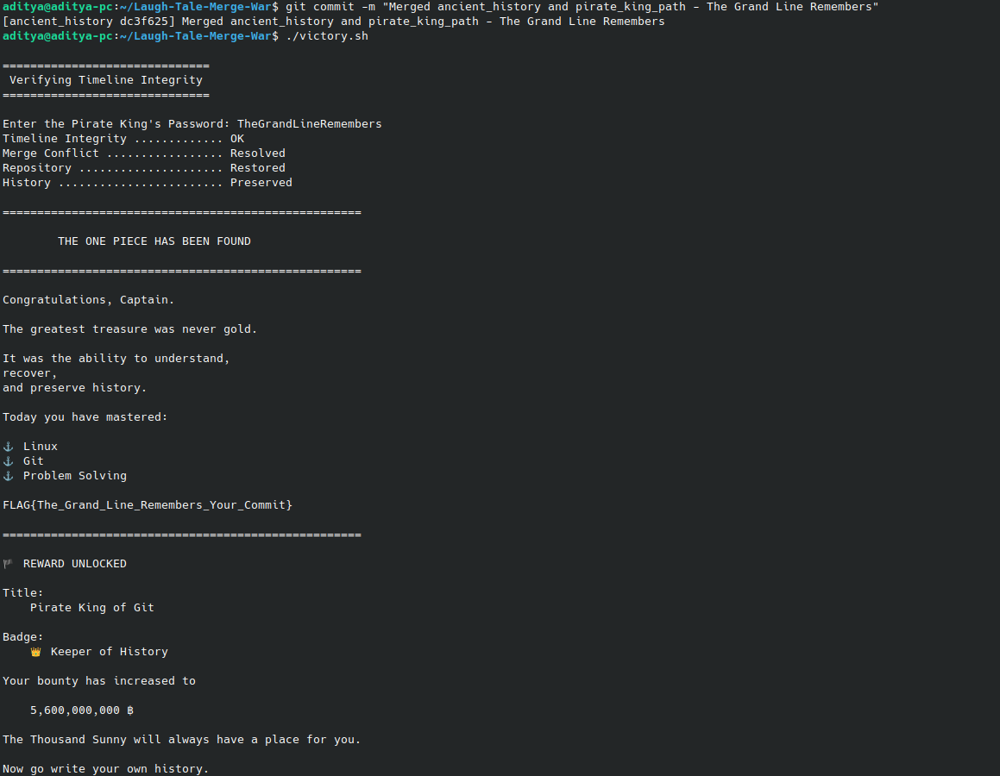

# amFOSS Task-01: Terminal Voyage

## Overview
**Goal:** Navigate through a fragmented Git history, recover lost files, decipher encrypted payloads, and resolve timeline conflicts to secure the final flag.

---

## Level Breakdown

### Levels 1: Loguetown Reef
* **Approach:** Used basic terminal commands to find, open and view the files and then ran ./eat.sh<filename> and ran the correct devil_fruit file.
* **Key Discoveries:** Recovered the Devil Fruit awakening signature: `ONE_PIECE{GITO_GITO_NO_AWAKENING}`.

### Levels 2: The Two Faces of Whiskey Peak
* **Approach:** Used Git commands to find and read the git commit history of the folder and found that there were indeed messages being passed in the commit hostory.
* **Key Discoveries:** Recovered an Encrypted Key: `BAROQUE_DIAL{SPLIT_TIMELINE_MISDIRECTION}`.

### Levels 3: The Wax Labyrinth of Little Garden
* **Approach:** Used specific Git commands to switch to the Wax_Jungle branch and also used grep to search for the unique encrypted key found in Level 2.
* **Key Discoveries:** Found a Security Log Access with the first fragment of the poneglyph: `KjY2MjF4bW0lKzYqNyBsIS0vbTAtJTcnL`.

### Levels 4: The Camouflaged Blueprints of Water 7
* **Approach:** Since the clue was pretty obvious about checking the files nature I used the `file` command and then pull the compressed file out and extracted it to find the second part of the poneglyph fragment.
* **Key Discoveries:** Found the second fragment of the poneglyph: `SwnbzptD1MJJSpyFiMuJ28PJzAlJ28VIZa=`.

### Level 5: The Buster Call Timeline Recovery
* **Approach:** From the clues I knew that the I had to fix the timeline, so I used `git log --oneline --all` to find a cannonical-timeline commit that i went through and found the hidden `.cp9_secure_vault` folder
* **Fragment I:** `KjY2MjF4bW0lKzYqNyBsIS0vbTAtJTcnL`
* **Fragment II:** `SwnbzptD1MJJSpyFiMuJ28PJzAlJ28VIZa=`
* **Decryption:** Inside the vault, I found a `poneglyph.py` script. I combined the two fragments from before and ran the script, which decoded the Base64 and did some XOR decryption with `0x42`. Honestly glad I found a way to run it without messing up the copy-pasting too much.
* **Result:** Uncovered the final hidden repository: `https://github.com/rogueone-x/Laugh-Tale-Merge-War`.

### Level 6: Laugh Tale Merge War
* **Approach:** I cloned the new hidden repo and saw there were two conflicting branches: `ancient_history` and `pirate_king_path`. I knew I had to merge them, but when I ran the merge command, it threw a bunch of merge conflicts in the `treasure/key_part_1.txt` and `key_part_2.txt` files.
* **Resolution:** With the clue in the README file I knew I had to fix the files first then merge them so it works, so I manually edited the files and merged them to find the password.
* **Final Password:** `TheGrandLineRemembers`

---

## Victory & Proof
Successfully executed `./victory.sh` with the merged password to prove timeline integrity.

**Final Flag:** `FLAG{The_Grand_Line_Remembers_Your_Commit}`
**Bounty:** 5,600,000,000 ฿

### Execution Proof

### Ubuntu / Linux Terminal Commands

*   `ls -la`: Lists all files, including hidden ones, with permissions.
*   `cd <directory>`: Navigates directly into the specified folder or repository.
*   `find . -executable -type f`: Searches current directory for any executable files.
*   `grep -rn "keyword" .`: Recursively searches files for a specific text string.
*   `file <filename>`: Determines the actual file type, ignoring the extension.
*   `tar -xf <archive>`: Extracts contents from a compressed tarball archive.
*   `unzip <archive.zip>`: Extracts files hidden inside a standard zip archive.
*   `cat <filename>`: Prints the entire contents of a text file.
*   `./<script.sh>`: Executes the specified shell script in the current directory.
*   `python3 <script.py>`: Runs a Python script directly in your terminal.

### Git Commands

*   `git clone <url>`: Downloads the target repository to your local machine.
*   `git branch -a`: Lists every local and remote branch available.
*   `git checkout <branch>`: Switches your working directory to a different branch.
*   `git checkout <commit-hash>`: Reverts your files back to a specific commit.
*   `git log --oneline`: Shows a compact, one-line summary of commit history.
*   `git log --oneline --all`: Shows compact commit history across all repository branches.
*   `git show <commit-hash>`: Displays the specific changes made in a commit.
*   `git merge <branch>`: Combines the specified branch into your current branch.
*   `git status`: Displays repository state and tracks merge conflict files.
*   `git add <file>`: Stages your manually resolved files for a commit.
*   `git commit -m "..."`: Saves the resolved merge with a descriptive message.