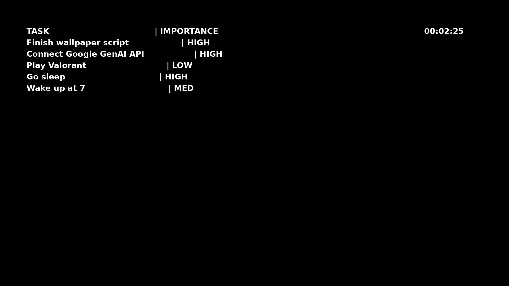

# TimeFlow Wallpaper Sync
---
a basic script in python using PILLOW, subprocess, glob and google

## Features:
1. **Live Digital Clock**: A clock that updates every second to run in your background.
2. **Smart File Watcher**: Monitors the file to check if it has been updated.
3. **Non-Blocking AI Pipeline**: After checking if file has been saved it sends it to the api to format the file.
4. **KDE Cache Buster**: Only works in KDE Plasme, automatically creates file with new name to make KDE wallpaper engine save it.
5. **Automatic Clean-up**: Since a new file is being created it waits for it and then deletes the previous file.

6. 

